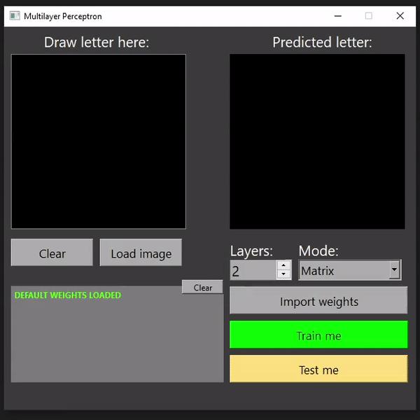

# Multilayer Perceptron
👁️‍🗨️ Implementation of a simple artificial neural network in the form of a perceptron, which can be trained on an open dataset and perform recognition of 26 handwritten letters of the Latin alphabet.

## Install:
1. Go to /src
2. Do ```make install```
3. Run from Desctop icon (or run executable ${PWD}/multilayer_perceptron/MultilayerPerceptron.app)

## Overview:



* The program supports two types of internal implementation: matrix and graph. This can be configured in the main menu of the program.
* If you change the number of internal layers or the implementation, you should load the appropriate weights or train the neural network again. The ```Weights``` folder contains ready-made weights for two-layer perceptron.
